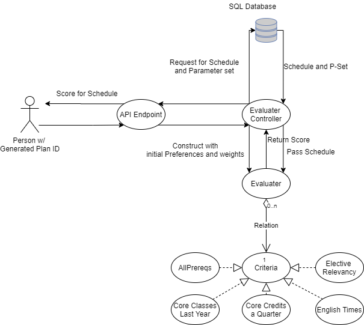

# Deterministic Schedule Evaluator

The purpose of this document is to provide an explanation behind the design, implementation and use of the deterministic Schedule evaluator.

## Design

To help accommodate the changing weight on preferences, types of preferences, and number of preferences, this algorithm is designed with a large emphasis on modularity.

### Evaluator.cs 

This object controls the main flow of the algorithm. This class has two class constants. These dictate how the schedules are evaluated and how each criteria is weighted.  The first is an array of type `CritTyp` this type is explained [here](#CritTyp.cs) and the second type is an array of doubles. This second array contains the weights corresponding to each Criteria in the `CritTyp` array. ___The doubles in the array must sum to 1___ 

To be used in the evaluate function, the constructor builds an array of type `Criteria` (_to see the explanation of the class `Criteria` go [here](#Criteria.cs)_). This array is kept in memory for multiple calls to the evaluate function. The array is built using the `CriteriaFactory` object. Where `CriteriaFactory` accepts an array of `CritTyp` and an array of doubles in its constructor and can be called on to return an array of `Criteria` objects. 

This object has one method `double result = evaluate(Schedule s)` where the Schedule being passed in is the schedule to be evaluated and result is the score determined by the algorithm. This function delegates all of the heavy lifting to the `Criteria` object, their interface requires them to implement a `getScore()` function.  This function once called on, returns the score for that given schedule (_Scaled to the weight it was previously given_). 

Evaluate lets each `Criteria` object visit the schedule and sum up the scores and that is the result.

(_May need to consider what to do if there is an edge case such that is a certain criteria fails the schedule should receive a 0_) 

### Criteria.cs

To further help with the modularity this class is a base class for all types of Criteria objects. This class has no concrete methods but is instead use to hold method signatures that any class extending this class must use. 

To store information that is used throughout the program the `Criteria` object has one field, and that is a double `weight` which is how much that specific criteria is weighted.

To judge if a schedule actually fulfills the criteria the `Criteria` class requires that all extended classes implement the `double result = getScore(Schedule s)`. This function takes in a schedule and returns the weighted score of if that schedule meets that criteria. 

### CriteriaFactory.cs

To encapsulate the construction of different types of `Criteria` objects the `CriteriaFactory` class acts as a factory for the `Criteria` objects.

The `CriteriaFactory` class's constructor takes in two parameters an array of type `CritTyp` and an array of doubles. So the factory knows which sub-classes to construct the method accept the first array. To know how much criteria should be weighted the factory also accepts the second parameter. 

__If the sum of all of the weights do not equal to one the factory throws an error warning the weights do not sum to one__

The `Criteria[] = getCriterias()` (_idk if that's right syntax_) method returns an array of `Criteria` objects dictated by the two arrays passed in at instantiation. 

### CritTyp.cs

To help with readability and minimize the manual mapping of numbers to Criteria sub classes, this enumeration was made to map numbers to criteria sub classes. When ever a new criteria class is created it is important to assign an enumeration value. 

## Criteria

The following section outlines all of the Concrete implementations of the abstract class Criteria. The section does not go into technical detail, but instead give a short overview of what each criteria is evaluating on. 

_(All of the criteria outlined below has been derived from the Weak Labeling Criteria proposed by Rigdha Acharya, Will Thomas, and CJ Hillbrand, approved by Dr. Parsons.)_

| Criteria            | Explanation                                                  |
| ------------------- | :----------------------------------------------------------- |
| AllPrereqs          | Validates that all prerequisites are satisfied for each course. |
| CoreClassesLastYear | Validates that the number of core classes scheduled for the last quarter is at or below the student preference. |
| CoreCreditsAQuarter | Validates that the number of core credits taken each quarter are at or below the student preference. |
| ElectiveRelevancy   | Validates that the electives taken are relevant to major course work? |
| EnglishTimes        | Validates that the first English Course taken matches the preferred English Course |
| MajorSpecificBreaks | Validates that the first Math Course taken matches the preferred Math Course |
| MathBreaks          | Validates that there are no breaks in any math sequence      |
| MaxQuarters         | Validates that the number of quarters scheduled do not exceed the preferred number of quarters scheduled. |
| PreprequisiteOrder  | Validates that no course is scheduled before all of the prerequisites are satisfied. |
| TimeOfDay           | Validates that all courses are scheduled at the preferred time of day. |

__Add header for Schedule.cs__

__Need to create a new section about the Controller for the API Layer__
